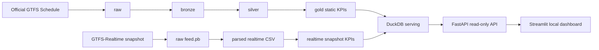

# Mobility Control Tower

Local Data Engineering platform for public transport data.

Mobility Control Tower processes Tisseo Toulouse GTFS Schedule data and bounded GTFS-Realtime snapshots into validated, queryable, teacher-friendly data products. It is a local academic MVP, not an enterprise monitoring platform.

## Architecture Overview



## Data Source

- Static GTFS: Tisseo Toulouse public transport schedule.
- GTFS-Realtime: one saved snapshot at a time.
- Licence: ODbL for the static source.
- Official dataset page: https://transport.data.gouv.fr/datasets/tisseo-reseau-transport-urbain-toulousain

## Implemented Features

- Static GTFS ingestion with immutable raw ZIP preservation.
- Metadata capture with SHA256 checksums.
- Bronze extraction and silver cleaned GTFS tables.
- GTFS quality validation reports.
- Gold static planning KPIs and charts.
- GTFS-Realtime snapshot fetch, raw protobuf preservation, and parsing.
- Static/live identifier compatibility checks.
- Realtime snapshot delay indicators.
- Local DuckDB serving database.
- Read-only FastAPI API.
- Read-only Streamlit dashboard.
- Teacher-facing reports and documentation.
- Pytest coverage for core behavior.

## Current Pipeline

Static:

```text
GTFS ZIP -> raw -> bronze -> silver -> validation -> gold KPIs -> charts/reports
```

Realtime snapshot:

```text
GTFS-RT feed.pb -> raw_realtime -> realtime parsed CSV -> realtime_gold KPIs -> charts/reports
```

Serving and demo:

```text
gold + realtime_gold -> DuckDB -> FastAPI -> Streamlit dashboard
```

## Quickstart

```bash
python -m venv .venv
source .venv/bin/activate
python -m pip install -e '.[dev]'
pytest
```

## Full Workflow

Replace placeholders with the run IDs printed by the commands.

```bash
python -m mobility_control_tower.cli ingest-gtfs --source tisseo --download
python -m mobility_control_tower.cli profile-gtfs --raw-run data/raw/tisseo/<static_run_id>
python -m mobility_control_tower.cli build-bronze --raw-run data/raw/tisseo/<static_run_id>
python -m mobility_control_tower.cli build-silver --bronze-run data/bronze/tisseo/<static_run_id>
python -m mobility_control_tower.cli validate-gtfs --silver-run data/silver/tisseo/<static_run_id>
python -m mobility_control_tower.cli build-gold --silver-run data/silver/tisseo/<static_run_id>
python -m mobility_control_tower.cli generate-static-charts --gold-run data/gold/tisseo/<static_run_id>
python -m mobility_control_tower.cli generate-demo-report --gold-run data/gold/tisseo/<static_run_id>
python -m mobility_control_tower.cli generate-static-mvp-report --gold-run data/gold/tisseo/<static_run_id>

python -m mobility_control_tower.cli fetch-gtfs-rt --source tisseo --feed-type trip_updates
python -m mobility_control_tower.cli parse-gtfs-rt --raw-rt-run data/raw_realtime/tisseo/trip_updates/<rt_run_id>
python -m mobility_control_tower.cli report-gtfs-rt --rt-run data/realtime/tisseo/trip_updates/<rt_run_id>
python -m mobility_control_tower.cli check-rt-compatibility --silver-run data/silver/tisseo/<static_run_id> --rt-run data/realtime/tisseo/trip_updates/<rt_run_id>
python -m mobility_control_tower.cli build-rt-gold --silver-run data/silver/tisseo/<static_run_id> --rt-run data/realtime/tisseo/trip_updates/<rt_run_id>
python -m mobility_control_tower.cli generate-rt-charts --rt-gold-run data/realtime_gold/tisseo/trip_updates/<rt_run_id>
python -m mobility_control_tower.cli generate-rt-snapshot-report --rt-gold-run data/realtime_gold/tisseo/trip_updates/<rt_run_id>

python -m mobility_control_tower.cli build-serving-db --gold-run data/gold/tisseo/<static_run_id> --rt-gold-run data/realtime_gold/tisseo/trip_updates/<rt_run_id>
python -m mobility_control_tower.cli generate-serving-report --serving-run data/serving/tisseo/<static_run_id>
```

## API Usage

Start the local read-only API:

```bash
python -m mobility_control_tower.cli serve-api \
  --db data/serving/tisseo/<static_run_id>/mobility_control_tower.duckdb \
  --host 127.0.0.1 \
  --port 8000
```

Example URLs:

- `http://127.0.0.1:8000/health`
- `http://127.0.0.1:8000/metadata`
- `http://127.0.0.1:8000/static/top-routes?limit=5`
- `http://127.0.0.1:8000/realtime/feed-health`
- `http://127.0.0.1:8000/docs`

Generate the API report:

```bash
python -m mobility_control_tower.cli generate-api-report \
  --db data/serving/tisseo/<static_run_id>/mobility_control_tower.duckdb
```

## Dashboard Usage

Start the API first, then run:

```bash
streamlit run src/mobility_control_tower/dashboard/app.py
```

Optional CLI helper:

```bash
python -m mobility_control_tower.cli serve-dashboard --api-url http://127.0.0.1:8000
```

The dashboard is read-only and consumes the FastAPI endpoints. It shows static planning KPIs, GTFS-Realtime snapshot indicators, compatibility, and limitations.

## Generated Reports

Reports are generated under `data/reports/`:

- GTFS profile report.
- GTFS quality report.
- Static demo report.
- Static MVP evidence report.
- GTFS-Realtime snapshot report.
- Realtime compatibility report.
- Realtime snapshot KPI report.
- Serving layer report.
- API report.
- Final project report.

Generate the final report:

```bash
python -m mobility_control_tower.cli generate-final-report \
  --serving-run data/serving/tisseo/<static_run_id>
```

## Testing

```bash
pytest
```

Tests use fake GTFS, fake GTFS-Realtime protobuf messages, temporary DuckDB databases, and mocked API responses. They do not require internet access.

## Limitations

- Local academic MVP, not production software.
- GTFS-Realtime is processed as snapshots, not streaming.
- No dashboard writes, authentication, deployment, Docker, cloud, Kafka, Spark, Airflow, PostgreSQL, ML, or RAG.
- Delay indicators from one snapshot are not route reliability metrics.
- Trip-level real-time compatibility may be imperfect.

## Future Roadmap

- Collect repeated GTFS-Realtime snapshots.
- Improve trip-level matching.
- Add a richer dashboard once the API contract is stable.
- Add scheduling/orchestration only after the local MVP is accepted.
- Consider PostgreSQL or production deployment only in a later phase.

## Academic Positioning

This project demonstrates Data Engineering fundamentals: ingestion, raw preservation, layered transformations, validation, KPI design, realtime snapshot parsing, local serving, API exposure, dashboard consumption, testing, and documentation.

It is intentionally scoped so a student can explain every layer clearly during a PFA presentation.
