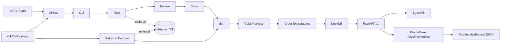

# Mobility Control Tower

Portfolio-quality data engineering platform for public transport analytics.

Mobility Control Tower turns GTFS static schedules and GTFS-Realtime snapshots into validated, historical, queryable mobility analytics. It is built as a local-first platform with production-inspired engineering: orchestration, analytics engineering, validation, observability, Docker, CI, and optional cloud-ready storage.

## Architecture Overview



See `docs/architecture/portfolio_architecture.md` for the polished portfolio diagram.

## Features

- Static GTFS ingestion with immutable raw preservation.
- GTFS-Realtime historical polling and protobuf parsing.
- Raw, Bronze, Silver, Gold medallion architecture.
- Partitioned Parquet historical storage.
- dbt staging, intermediate, and mart models after Silver.
- Great Expectations suites and Data Docs.
- DuckDB serving layer with efficient Parquet-backed views.
- FastAPI read-only API with `/v1/` versioned routes.
- Streamlit dashboard with operational, historical, and data-quality pages.
- Apache Airflow DAGs that call the CLI.
- Prometheus metrics and Grafana dashboard JSON.
- Optional local/S3 storage abstraction via boto3.
- Multi-city configuration: Tisseo Toulouse and STAR Rennes.
- Performance benchmark command and Markdown reports.
- Docker, Docker Compose, GitHub Actions, pre-commit, Ruff, Black, isort, MyPy, coverage.

## Screenshots

Placeholders for portfolio media:

- `docs/screenshots/dashboard-operational.png`
- `docs/screenshots/dashboard-history.png`
- `docs/screenshots/dashboard-quality.png`
- `docs/screenshots/airflow-dags.png`
- `docs/screenshots/demo.gif`

## Tech Stack

Python 3.10, Pandas, PyArrow, DuckDB, FastAPI, Streamlit, APScheduler, Airflow, dbt Core, dbt-duckdb, Great Expectations, Prometheus client, boto3, Docker, pytest, coverage.py, Ruff, Black, isort, MyPy.

## Quick Start

```bash
cp .env.example .env
docker compose up --build
```

Local URLs:

- API: `http://localhost:8000`
- OpenAPI: `http://localhost:8000/docs`
- Dashboard: `http://localhost:8501`
- Airflow: `http://localhost:8080`
- Prometheus metrics: `http://localhost:8000/pipeline/metrics`

## Local Development

```bash
python -m venv .venv
source .venv/bin/activate
python -m pip install --upgrade pip
python -m pip install -e '.[dev,quality]'
PYTHONPATH=src python -m pytest
```

## Docker

The Docker image is multi-stage, non-root, healthchecked, and supports CLI, FastAPI, Streamlit, and Airflow commands.

```bash
docker compose up --build
docker compose run --rm api cli --help
```

Compose services:

- `api`
- `dashboard`
- `airflow-init`
- `airflow-webserver`
- `airflow-scheduler`

## Airflow

Airflow orchestrates the CLI instead of replacing it.

- `daily_static_pipeline`: ingestion, Bronze, Silver, dbt, Great Expectations, reports, serving.
- `realtime_collection`: one realtime poll, dbt historical marts, Great Expectations, serving refresh.

```bash
docker compose exec airflow-webserver airflow dags trigger daily_static_pipeline
docker compose exec airflow-webserver airflow dags trigger realtime_collection
```

## API

Versioned routes are available under `/v1/`; unversioned compatibility routes remain.

Examples:

- `/v1/health`
- `/v1/metadata`
- `/v1/static/top-routes`
- `/v1/history/routes`
- `/v1/quality/summary`
- `/pipeline/metrics`

## Dashboard Usage

The Streamlit dashboard includes:

- Operational MVP
- Historical Analytics
- Data Quality

## dbt

dbt starts after Python Silver and historical Parquet:

```bash
PYTHONPATH=src python -m mobility_control_tower.cli run-dbt \
  --silver-run data/silver/tisseo/<run_id> \
  --history-run data/realtime_history/tisseo/trip_updates

PYTHONPATH=src python -m mobility_control_tower.cli test-dbt
PYTHONPATH=src python -m mobility_control_tower.cli generate-dbt-docs
```

## Great Expectations

```bash
PYTHONPATH=src python -m mobility_control_tower.cli run-ge-validation \
  --suite all \
  --silver-run data/silver/tisseo/<run_id> \
  --gold-run data/dbt_gold/tisseo/<dbt_run_id> \
  --history-run data/realtime_history/tisseo/trip_updates
```

## Observability

Prometheus metrics are exposed at:

```text
/pipeline/metrics
```

Metrics include pipeline duration, successes, failures, rows processed, API requests, historical polls, feed freshness, and DuckDB query duration.

Grafana dashboard JSON:

```text
grafana/mobility-control-tower-dashboard.json
```

## Cloud-Ready Storage

Local mode remains the default. Optional S3 storage is selected with settings:

```bash
MCT_STORAGE_BACKEND=local
MCT_STORAGE_BACKEND=s3
MCT_S3_BUCKET=<bucket>
MCT_S3_PREFIX=mobility-control-tower
```

The abstraction is implemented in `src/mobility_control_tower/storage.py`.

## Multi-City Support

Configured sources:

- `tisseo`: Toulouse Tisseo
- `star_rennes`: Rennes STAR

Each source has independent config, storage roots, serving paths, and report paths through the existing CLI arguments.

## Performance Benchmarks

```bash
PYTHONPATH=src python -m mobility_control_tower.cli run-benchmarks \
  --silver-run data/silver/tisseo/<run_id> \
  --gold-run data/gold/tisseo/<run_id> \
  --history-run data/realtime_history/tisseo/trip_updates \
  --db data/serving/tisseo/<run_id>/mobility_control_tower.duckdb
```

Reports are written to `data/benchmarks/`.

## Testing And Quality

```bash
ruff check .
black --check .
isort --check-only .
mypy src
coverage run -m pytest
coverage html
```

## CI

GitHub Actions run on push and pull request:

- dependency installation
- Ruff
- Black
- isort
- MyPy
- pytest with coverage
- Docker build

## Documentation

- `docs/portfolio_case_study.md`
- `docs/interview_questions.md`
- `docs/settings.md`
- `docs/airflow.md`
- `docs/dbt.md`
- `docs/great_expectations.md`
- `docs/historical_collection.md`
- `docs/architecture/`

## Roadmap

- Native S3 writes in every data-producing module.
- Real Prometheus and Grafana Compose profile.
- More French networks and city comparison dashboards.
- API authentication and rate limiting.
- More exhaustive CLI and dashboard coverage.

## Academic Positioning

The project remains explainable as a data engineering academic MVP while presenting production-inspired practices: reproducibility, orchestration, validation, observability, typed configuration, cloud-ready interfaces, CI, and documentation.
