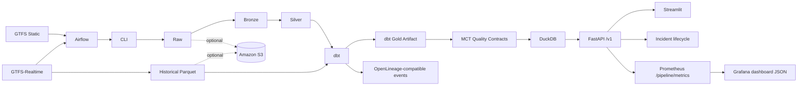

# Mobility Control Tower

Local-first, production-inspired public transport control tower and portfolio project.

Mobility Control Tower converts GTFS Schedule and GTFS-Realtime feeds into validated operational intelligence, historical reliability indicators, traceable incidents, and secure analytical APIs. It is not a certified agency dispatch system, predictive AI product, or proof of passenger impact.

## Architecture Overview



See `docs/architecture/portfolio_architecture.md` for the polished portfolio diagram.

## Features

- Static GTFS ingestion with immutable raw preservation.
- GTFS-Realtime Trip Updates, Vehicle Positions, and Service Alerts where a source provides them.
- Raw, Bronze, Silver, Gold medallion architecture.
- Partitioned Parquet historical storage.
- dbt staging, intermediate, mart, and authoritative reliability KPI models after Silver.
- MCT quality-contract suites and generated validation docs.
- DuckDB serving layer with efficient Parquet-backed views.
- FastAPI operator API with bounded read endpoints and scoped incident mutations.
- Streamlit operator dashboard for current status, incidents, route reliability, fleet, alerts, data trust, and city comparison.
- Persistent incident lifecycle with acknowledgement, resolution, deduplication, evidence, and audit events.
- Expiring bearer tokens with scopes for operator writes.
- OpenLineage-compatible local event generation with honest backend status.
- Apache Airflow DAGs that call the CLI.
- Prometheus metrics and Grafana dashboard JSON.
- Optional local/S3 storage abstraction via boto3.
- Multi-city configuration: Tisseo Toulouse and STAR Rennes.
- Performance benchmark command and Markdown reports.
- Docker, Docker Compose, GitHub Actions, pre-commit, Ruff, Black, isort, MyPy, coverage.

## Portfolio Evidence

Screenshots are generated from the deterministic demo when Docker is available. Placeholder screenshots are not committed. Use `make demo`, then capture dashboard, Grafana, Airflow, and API documentation views from the local URLs below.

## Tech Stack

Python 3.10, Pandas, PyArrow, DuckDB, FastAPI, Streamlit, APScheduler, Airflow, dbt Core, dbt-duckdb, Prometheus client, boto3, Docker, pytest, coverage.py, Ruff, Black, isort, MyPy.

## Deterministic Demo

```bash
cp .env.example .env
make demo
make demo-smoke
make lineage-smoke
make security-check
```

Local URLs:

- API: `http://localhost:8000`
- API readiness: `http://localhost:8000/health/ready`
- OpenAPI: `http://localhost:8000/docs`
- Dashboard: `http://localhost:8501`
- Airflow: `http://localhost:8080`
- Prometheus: `http://localhost:9090`
- Grafana: `http://localhost:3000`
- MCT metrics exporter: `http://localhost:9108/metrics`

The demo uses deterministic fixture Silver data and committed historical realtime snapshots. It does not fetch live feeds.
Reliability values served by the API and dashboard come from dbt-produced Gold
marts exposed through DuckDB serving views. Python reliability helpers are kept
only for diagnostics, fixture support, or migration reconciliation.

Non-Docker local checks:

```bash
python scripts/create_deterministic_fixture.py
dbt build --project-dir dbt --profiles-dir dbt --vars '{"silver_run":"data/fixtures/silver/tisseo/phase1","history_run":"data/fixtures/realtime_history/tisseo/trip_updates"}'
make verify-restore
make benchmark
```

## Local Development

```bash
python -m venv .venv
source .venv/bin/activate
python -m pip install --upgrade pip
python -m pip install -e '.[dev,quality,analytics,orchestration]'
PYTHONPATH=src python -m pytest
```

## Docker

The Docker image is multi-stage and non-root. Compose provides service-specific health checks and uses PostgreSQL for Airflow metadata.

```bash
docker compose --profile demo up --build -d
docker compose run --rm api cli --help
```

Compose services:

- `postgres`
- `demo-bootstrap`
- `api`
- `dashboard`
- `airflow-init`
- `airflow-webserver`
- `airflow-scheduler`
- `metrics-exporter`
- `prometheus`
- `grafana`

## Airflow

Airflow orchestrates the CLI instead of replacing it.

- `daily_static_pipeline`: ingestion, Bronze, Silver, real dbt build, MCT quality contracts, reports, serving publication.
- `realtime_snapshot_collection`: one bounded realtime poll and committed snapshot only.
- `realtime_incremental_refresh`: committed snapshots after the watermark, dbt historical marts, quality, serving refresh, watermark update last.
- `daily_platform_maintenance`: full-history quality and safe storage inventory.

```bash
docker compose exec airflow-webserver airflow dags trigger daily_static_pipeline
docker compose exec airflow-webserver airflow dags trigger realtime_snapshot_collection
docker compose exec airflow-webserver airflow dags trigger realtime_incremental_refresh
```

## API

Versioned routes are available under `/v1/`; unversioned compatibility routes remain.

Examples:

- `/v1/health`
- `/v1/metadata`
- `/v1/static/top-routes`
- `/v1/history/routes`
- `/v1/quality/summary`
- `/pipeline/metrics`

## Dashboard Usage

The Streamlit dashboard includes:

- Operational MVP
- Historical Analytics
- Data Quality

## dbt

dbt starts after Python Silver and historical Parquet:

```bash
PYTHONPATH=src python -m mobility_control_tower.cli run-dbt \
  --silver-run data/silver/tisseo/<run_id> \
  --history-run data/realtime_history/tisseo/trip_updates

PYTHONPATH=src python -m mobility_control_tower.cli test-dbt
PYTHONPATH=src python -m mobility_control_tower.cli generate-dbt-docs
```

## MCT Quality Contracts

```bash
PYTHONPATH=src python -m mobility_control_tower.cli run-quality-validation \
  --suite all \
  --silver-run data/silver/tisseo/<run_id> \
  --gold-run data/dbt_gold/tisseo/<dbt_run_id> \
  --history-run data/realtime_history/tisseo/trip_updates
```

## Serving Artifact Contract

Production consumers resolve DuckDB through `data/serving/<source>/current.json`. Serving runs live under `data/serving/<source>/runs/<serving_run_id>/` with `mobility_control_tower.duckdb` and `serving_manifest.json`. Publication builds in a temporary run directory, validates the database, renames the run into place, and replaces `current.json` last. Failed builds preserve the prior current artifact.

## Observability

API process metrics are exposed at:

```text
/pipeline/metrics
```

The MCT metrics exporter exposes durable pipeline, watermark, serving, quality, and collection metrics at `/metrics`. Prometheus scrapes both API and exporter endpoints.

Grafana dashboards and Prometheus rules are provisioned from:

```text
observability/grafana/
observability/prometheus/
```

## Cloud-Ready Storage

Local mode remains the default. Optional S3 storage is selected with settings:

```bash
MCT_STORAGE_BACKEND=local
MCT_STORAGE_BACKEND=s3
MCT_S3_BUCKET=<bucket>
MCT_S3_PREFIX=mobility-control-tower
```

The abstraction is implemented in `src/mobility_control_tower/storage.py`.

## Multi-City Support

Configured sources:

- `tisseo`: Toulouse Tisseo
- `star_rennes`: Rennes STAR

Each source has independent config, storage roots, serving paths, and report paths through the existing CLI arguments.

## Performance Benchmarks

```bash
PYTHONPATH=src python -m mobility_control_tower.cli run-benchmarks \
  --silver-run data/silver/tisseo/<run_id> \
  --gold-run data/gold/tisseo/<run_id> \
  --history-run data/realtime_history/tisseo/trip_updates \
  --db data/serving/tisseo/<run_id>/mobility_control_tower.duckdb
```

Reports are written to `data/benchmarks/`.

## Testing And Quality

```bash
ruff check .
black --check .
isort --check-only .
mypy src
coverage run -m pytest
coverage report --fail-under=80
```

## Deterministic Analytical Fixture

```bash
python scripts/create_deterministic_fixture.py
python -m mobility_control_tower.cli run-dbt --silver-run data/fixtures/silver/tisseo/phase1 --history-run data/fixtures/realtime_history/tisseo/trip_updates --output-root data/fixtures/dbt_gold
python -m mobility_control_tower.cli run-quality-validation --suite all --silver-run data/fixtures/silver/tisseo/phase1 --gold-run data/fixtures/dbt_gold/tisseo/<dbt_run_id> --history-run data/fixtures/realtime_history/tisseo/trip_updates
python -m mobility_control_tower.cli build-serving-db --gold-run data/fixtures/dbt_gold/tisseo/<dbt_run_id> --history-run data/fixtures/realtime_history/tisseo/trip_updates --history-gold-run data/fixtures/dbt_gold/tisseo/<dbt_run_id> --serving-root data/fixtures/serving
python -m mobility_control_tower.cli query-serving-db --db data/fixtures/serving/tisseo/<dbt_run_id>/mobility_control_tower.duckdb --query-name network-overview --limit 10
```

## CI

GitHub Actions run on push and pull request:

- dependency installation
- Ruff
- Black
- isort
- MyPy
- pytest with coverage
- incident-store migration and deterministic incident evaluation
- Docker build
- `release-proof`, which builds the Compose image, starts PostgreSQL/Airflow/API/dashboard/Prometheus/Grafana, runs PostgreSQL-backed incident evaluation, browser smoke tests, screenshots, restore verification, failure injection, and uploads `artifacts/release-evidence/`

The `release-proof` job is the authoritative Docker runtime gate. Local WSL environments without Docker must not be treated as Compose verification.

## Operational Incidents

Reliability incidents are evaluated from authoritative dbt and serving outputs, not from Python KPI recalculation. Local non-Docker mode defaults to SQLite. Docker Compose and production profiles use PostgreSQL through `MCT_INCIDENT_BACKEND=postgres` and `MCT_INCIDENT_DATABASE_URL`.

Run `python -m mobility_control_tower.cli migrate-incident-store --json` before first use, then `python -m mobility_control_tower.cli evaluate-incidents --source tisseo --json` after serving publication. See `docs/incidents.md` for rule versions, state transitions, suppression, API scopes, dashboard behavior, and Prometheus metrics.

## Runtime Evidence

Release evidence is generated by GitHub Actions and stored as workflow artifacts:

- `artifacts/release-evidence/manifest.json`
- runtime health, Airflow, Prometheus, Grafana, browser, restore, and failure-injection reports
- container logs and Compose status
- deterministic screenshots under `artifacts/release-evidence/screenshots/`

Repository portfolio screenshots are committed only after successful deterministic capture. CI diagnostic screenshots, traces, and logs remain workflow artifacts.

## Documentation

- `docs/portfolio_case_study.md`
- `docs/interview_questions.md`
- `docs/settings.md`
- `docs/airflow.md`
- `docs/dbt.md`
- `docs/quality_contracts.md`
- `docs/historical_collection.md`
- `docs/incidents.md`
- `docs/architecture/`

## Roadmap

- Native S3 writes in every data-producing module.
- Real Prometheus and Grafana Compose profile.
- More French networks and city comparison dashboards.
- API authentication and rate limiting.
- More exhaustive CLI and dashboard coverage.

## Academic Positioning

The project remains explainable as a data engineering academic MVP while presenting production-inspired practices: reproducibility, orchestration, validation, observability, typed configuration, cloud-ready interfaces, CI, and documentation.
