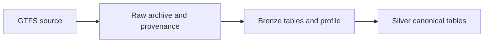

# Mobility Control Tower

## Overview

Mobility Control Tower implements a local static GTFS medallion pipeline for Tisséo. Raw preserves the acquired archive, Bronze exposes faithful source tables and profiles, and Silver produces cleaned, typed GTFS tables for downstream analysis.

## Data Flow


```mermaid
flowchart LR
    S[GTFS source] --> R[Raw archive and provenance]
    R --> B[Bronze tables and profile]
    B --> V[Silver canonical tables]
```

The boundaries are deliberate: acquisition evidence is immutable, source-shape inspection belongs in Bronze, and normalization belongs in Silver.

## Running the Project

```bash
python -m pip install -e .
mobility-control-tower --help
mobility-control-tower ingest-gtfs
```

CLI help lists the available Bronze and Silver commands and their run-path arguments. See [`docs/data_source.md`](docs/data_source.md) for provenance.

## Limitations

The project creates curated tables but does not enforce a formal quality contract or produce Gold analytics. Execution and storage remain local.
