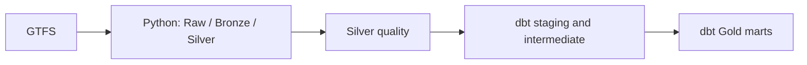

# Mobility Control Tower

## Overview

The analytical boundary is explicit: Python owns GTFS ingestion and Raw, Bronze, and Silver; dbt owns analytical transformations from Silver to Gold. The dbt project provides staging, intermediate models, tested marts, reconciliation tests, and unit tests for schedule-based indicators.

## Architecture


```mermaid
flowchart LR
    G[GTFS] --> P[Python: Raw / Bronze / Silver]
    P --> Q[Silver quality]
    Q --> D[dbt staging and intermediate]
    D --> M[dbt Gold marts]
```

## Running and Verification

```bash
python -m pip install -e '.[quality,analytics]'
mobility-control-tower run-dbt
mobility-control-tower test-dbt
```

The commands require a valid Silver run; use CLI help for arguments. dbt configuration and models live under `dbt/`.

## Limitations

Gold marts are local build artifacts. No serving database, API, dashboard, realtime feed, or orchestrator exists. dbt success is not substituted by a Python Gold fallback.
