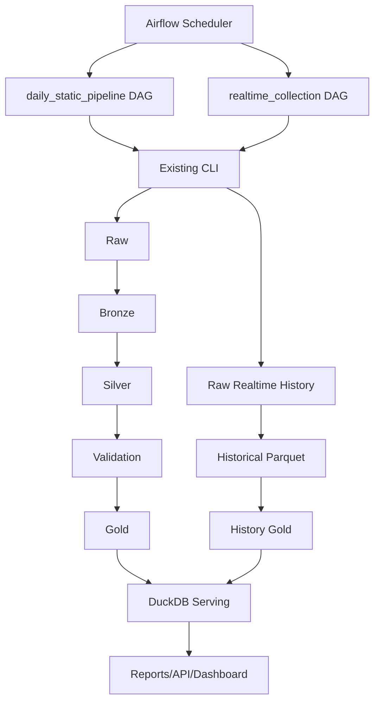
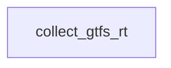
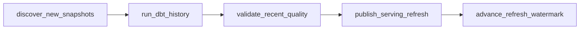

# Airflow Orchestration

The Mobility Control Tower now includes an Apache Airflow orchestration layer. Airflow does not replace the application pipeline. It schedules and executes the existing CLI commands.

## Architecture



Airflow files live under `airflow/`:

```text
airflow/
  dags/
    daily_static_pipeline.py
    realtime_collection.py
    mct_airflow_utils.py
  plugins/
  logs/
  config/
  README.md
```

Application code remains under `src/mobility_control_tower/`.

## DAGs

### `daily_static_pipeline`

Schedule: once daily, `@daily`.

Task graph:



```mermaid
flowchart LR
    A[ingest_gtfs] --> B[profile_gtfs]
    B --> C[build_bronze]
    C --> D[build_silver]
    D --> E[validate_gtfs]
    E --> F[run_dbt_models]
    F --> G[validate_with_quality_contracts]
    G --> H[generate_static_charts]
    H --> I[generate_demo_report]
    I --> J[build_serving_db]
```

CLI commands called:

- `ingest-gtfs`
- `profile-gtfs`
- `build-bronze`
- `build-silver`
- `validate-gtfs`
- `run-dbt`
- `run-quality-validation`
- `generate-static-charts`
- `generate-demo-report`
- `build-serving-db`

### `realtime_snapshot_collection`

Schedule: every minute, `* * * * *`.

Task graph:



The collector task runs one bounded poll per DAG run by calling:

```bash
python -m mobility_control_tower.cli collect-gtfs-rt --max-polls 1
```

This keeps Airflow in control of scheduling while preserving the CLI as the source of truth. New snapshots are appended to historical Parquet partitions; existing snapshots are not overwritten.

The one-minute collector does not rebuild dbt history or serving artifacts. It writes raw protobuf, parsed Parquet, metadata, and `_SUCCESS` commit markers only.

### `realtime_incremental_refresh`

Schedule: every 10 minutes, `*/10 * * * *`.



The refresh DAG reads committed snapshots after the durable analytical watermark, applies the configured lookback, runs dbt historical marts, validates MCT quality contracts, publishes serving atomically, and advances the watermark last.

## Retries And Failure Handling

Every task is configured with:

- retries: `3`
- retry delay: `2 minutes`
- execution timeout: `45 minutes` for static tasks
- execution timeout: `20 minutes` for realtime tasks

Airflow’s default dependency behavior applies: if one task fails after retries, downstream tasks do not execute.

## Variables

The DAGs use Airflow Variables with local defaults:

| Variable | Default | Purpose |
| --- | --- | --- |
| `mct_gtfs_source` | `tisseo` | GTFS source id |
| `mct_realtime_feed_type` | `trip_updates` | Realtime feed type |
| `mct_polling_interval` | `30` | Collector interval passed to CLI |
| `mct_sources_config` | `config/sources.yml` | Source config file |
| `mct_raw_root` | `data/raw` | Static raw root |
| `mct_bronze_root` | `data/bronze` | Bronze root |
| `mct_silver_root` | `data/silver` | Silver root |
| `mct_gold_root` | `data/gold` | Gold root |
| `mct_reports_dir` | `data/reports` | Reports root |
| `mct_serving_root` | `data/serving` | Serving DB root |
| `mct_raw_history_root` | `data/raw_realtime/historical` | Raw realtime archive |
| `mct_history_root` | `data/realtime_history` | Parsed historical Parquet root |
| `mct_history_gold_root` | `data/history_gold` | Historical KPI root |
| `mct_pipeline_runs_root` | `data/pipeline_runs` | Per-task execution metadata |
| `mct_latest_static_gold_run` | empty | Optional explicit static gold run for realtime serving refresh |

Set variables with the Airflow CLI:

```bash
airflow variables set mct_gtfs_source tisseo
airflow variables set mct_polling_interval 30
airflow variables set mct_serving_root data/serving
airflow variables set mct_history_root data/realtime_history
```

## Execution Metadata

Each CLI task writes metadata to:

```text
data/pipeline_runs/<dag_id>/<airflow_run_id>/<task_id>.json
```

Metadata includes:

- `run_id`
- `dag_id`
- `task_id`
- command
- start time
- end time
- duration
- status
- rows processed when available
- output path when available
- stdout/stderr tails

## Notifications

The DAGs include `notify_failure` and `notify_success` callbacks. They currently log notification-ready messages only. These functions are intentionally small extension points for email or Slack later.

## Start Airflow Locally

Install Airflow separately from the core project environment when possible:

```bash
python -m pip install 'apache-airflow>=2,<3'
```

Initialize Airflow:

```bash
export AIRFLOW_HOME="$PWD/airflow"
airflow db migrate
airflow users create \
  --username admin \
  --firstname Admin \
  --lastname User \
  --role Admin \
  --email admin@example.com
```

Start the webserver and scheduler in separate terminals:

```bash
export AIRFLOW_HOME="$PWD/airflow"
airflow webserver --port 8080
```

```bash
export AIRFLOW_HOME="$PWD/airflow"
airflow scheduler
```

Trigger manually:

```bash
airflow dags trigger daily_static_pipeline
airflow dags trigger realtime_collection
```

List tasks:

```bash
airflow tasks list daily_static_pipeline
airflow tasks list realtime_collection
```
## Incident Evaluation Boundary

`realtime_incremental_refresh` evaluates reliability incidents only after dbt, quality validation, and atomic serving publication. The task passes correlation metadata and small identifiers through Airflow; incident state is persisted in the incident repository, never in XCom. `daily_platform_maintenance` also runs platform incident evaluation for freshness, quality, and serving artifact state. Lock conflicts are explicit and retry-safe.
# Runtime Verification

The `release-proof` workflow verifies Airflow in the running Compose stack:

- webserver `/health`;
- scheduler-specific `airflow jobs check --job-type SchedulerJob`;
- parsed DAG list and import errors;
- `realtime_incremental_refresh` task ordering, with `evaluate_reliability_incidents` downstream of `publish_serving_refresh`;
- PostgreSQL-backed incident evaluation from Airflow-compatible environment variables.

Incident state is never stored in XCom. XCom carries bounded metadata such as paths, run IDs, and correlation IDs.
