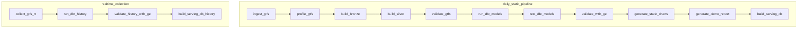

# Airflow DAG Overview

```mermaid
flowchart TD
    subgraph daily_static_pipeline
        A1[ingest_gtfs] --> A2[profile_gtfs]
        A2 --> A3[build_bronze]
        A3 --> A4[build_silver]
        A4 --> A5[validate_gtfs]
        A5 --> A6[run_dbt_models]
        A6 --> A7[test_dbt_models]
        A7 --> A8[validate_with_ge]
        A8 --> A9[generate_static_charts]
        A9 --> A10[generate_demo_report]
        A10 --> A11[build_serving_db]
    end

    subgraph realtime_collection
        R1[collect_gtfs_rt] --> R2[run_dbt_history]
        R2 --> R3[validate_history_with_ge]
        R3 --> R4[build_serving_db_history]
    end
```

