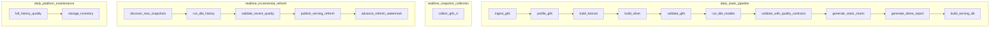

# Airflow DAG Overview

```mermaid
flowchart TD
    subgraph daily_static_pipeline
        A1[ingest_gtfs] --> A2[profile_gtfs]
        A2 --> A3[build_bronze]
        A3 --> A4[build_silver]
        A4 --> A5[validate_gtfs]
        A5 --> A6[run_dbt_models]
        A6 --> A7[validate_with_quality_contracts]
        A7 --> A8[generate_static_charts]
        A8 --> A9[generate_demo_report]
        A9 --> A10[build_serving_db]
    end

    subgraph realtime_snapshot_collection
        R1[collect_gtfs_rt]
    end

    subgraph realtime_incremental_refresh
        H1[discover_new_snapshots] --> H2[run_dbt_history]
        H2 --> H3[validate_recent_quality]
        H3 --> H4[publish_serving_refresh]
        H4 --> H5[advance_refresh_watermark]
    end

    subgraph daily_platform_maintenance
        M1[full_history_quality] --> M2[storage_inventory]
    end
```
