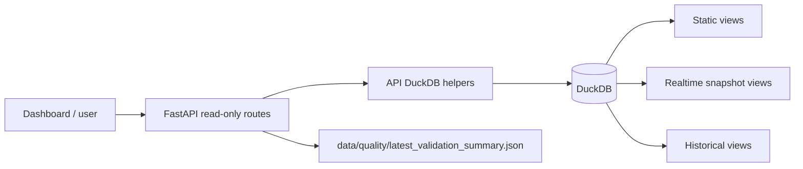

# API Architecture

```mermaid
flowchart LR
    CLIENT[Dashboard / user] --> FASTAPI[FastAPI read-only routes]
    FASTAPI --> DBHELPERS[API DuckDB helpers]
    DBHELPERS --> DUCK[(DuckDB)]
    DUCK --> STATIC[Static views]
    DUCK --> RT[Realtime snapshot views]
    DUCK --> HISTORY[Historical views]
    FASTAPI --> QUALITY[data/quality/latest_validation_summary.json]
```

