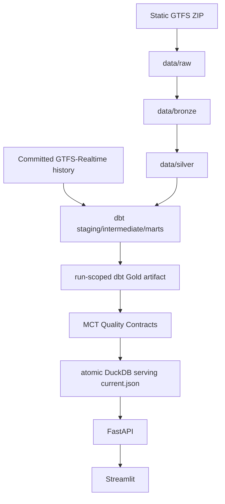

# Data Flow



Python owns Raw, Bronze, Silver, GTFS-Realtime collection, immutable snapshot
commit, orchestration, API schemas, and operational control. dbt owns
authoritative Gold analytics, including reliability eligibility, observation
facts, delay distributions, on-time performance, explicit cancellations,
headways, excess waiting time, and network reliability summaries. DuckDB serving
exposes the dbt-produced reliability marts through stable views; API,
dashboard, and incident inputs do not calculate production reliability KPIs in
Python.
## Incident Data Flow

```text
dbt reliability marts
        ↓
v_reliability_incident_snapshot and serving reliability views
        ↓
versioned incident evaluator
        ↓
transactional incident repository and immutable events
        ↓
operator API, dashboard, and aggregate Prometheus metrics
```

The incident evaluator consumes authoritative mart outputs and platform manifests. It does not rebuild reliability facts in Python.
# Release Runtime Proof Flow

```text
PostgreSQL
  ├── Airflow metadata
  └── MCT incident application data

Airflow
  → deterministic processing
  → dbt reliability marts
  → quality validation
  → atomic DuckDB serving publication
  → incident evaluation

API/dashboard
  → current serving artifact
  → PostgreSQL incident state

metrics exporter
  → durable incident and serving metrics
  → Prometheus
  → Grafana

Playwright
  → browser product smoke
  → deterministic screenshots
  → release evidence artifacts
```

dbt remains the authoritative analytical owner. The incident evaluator consumes serving views and validated manifests; it does not recalculate reliability KPIs.
