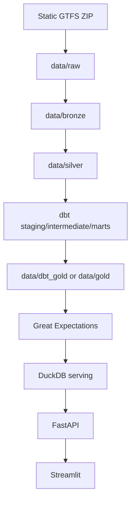

# Data Flow

```mermaid
flowchart TD
    GTFS[Static GTFS ZIP] --> RAW[data/raw]
    RAW --> BRONZE[data/bronze]
    BRONZE --> SILVER[data/silver]
    SILVER --> DBT[dbt staging/intermediate/marts]
    DBT --> GOLD[data/dbt_gold or data/gold]
    GOLD --> GE[Great Expectations]
    GE --> SERVE[DuckDB serving]
    SERVE --> API[FastAPI]
    API --> DASH[Streamlit]
```

