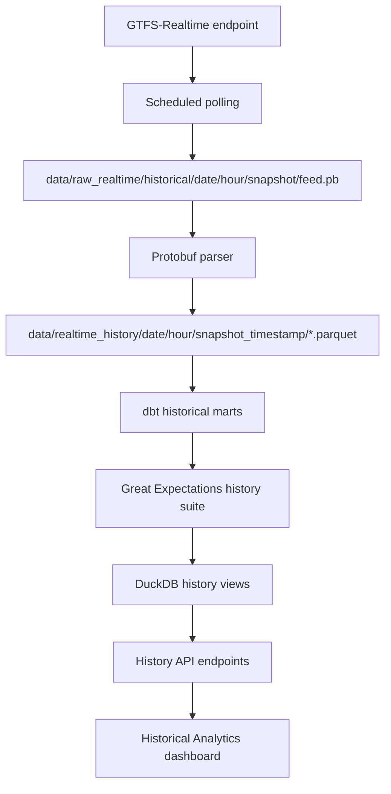

# Historical Realtime Flow

```mermaid
flowchart TD
    FEED[GTFS-Realtime endpoint] --> POLL[Scheduled polling]
    POLL --> RAW[data/raw_realtime/historical/date/hour/snapshot/feed.pb]
    RAW --> PARSE[Protobuf parser]
    PARSE --> PARQUET[data/realtime_history/date/hour/snapshot_timestamp/*.parquet]
    PARQUET --> DBT[dbt historical marts]
    DBT --> GE[Great Expectations history suite]
    GE --> DUCK[DuckDB history views]
    DUCK --> API[History API endpoints]
    API --> DASH[Historical Analytics dashboard]
```

