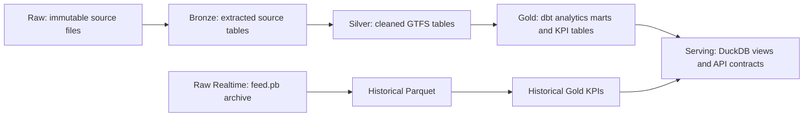

# Medallion Architecture

```mermaid
flowchart LR
    RAW[Raw: immutable source files] --> BRONZE[Bronze: extracted source tables]
    BRONZE --> SILVER[Silver: cleaned GTFS tables]
    SILVER --> GOLD[Gold: dbt analytics marts and KPI tables]
    GOLD --> SERVING[Serving: DuckDB views and API contracts]

    RAWRT[Raw Realtime: feed.pb archive] --> HIST[Historical Parquet]
    HIST --> HGOLD[Historical Gold KPIs]
    HGOLD --> SERVING
```

