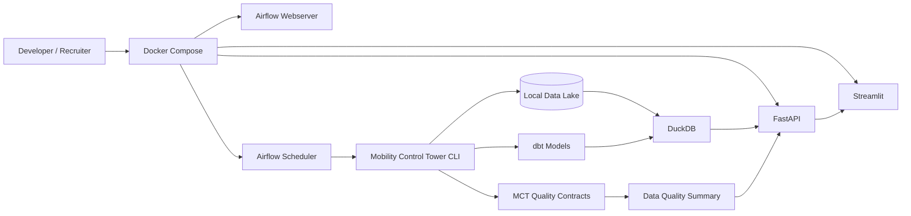

# Overall Architecture

```mermaid
flowchart LR
    DEV[Developer / Recruiter] --> DOCKER[Docker Compose]
    DOCKER --> API[FastAPI]
    DOCKER --> DASH[Streamlit]
    DOCKER --> AFW[Airflow Webserver]
    DOCKER --> AFS[Airflow Scheduler]

    AFS --> CLI[Mobility Control Tower CLI]
    CLI --> DATA[(Local Data Lake)]
    DATA --> DUCK[DuckDB]
    DUCK --> API
    API --> DASH

    CLI --> DBT[dbt Models]
    CLI --> QC[MCT Quality Contracts]
    DBT --> DUCK
    QC --> QUALITY[Data Quality Summary]
    QUALITY --> API
```
