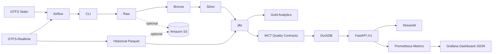

# Portfolio Architecture Diagram

```mermaid
flowchart LR
    GTFS[GTFS Static] --> AIR[Airflow]
    GRT[GTFS-Realtime] --> AIR
    AIR --> CLI[CLI]
    CLI --> RAW[Raw]
    RAW --> BRONZE[Bronze]
    BRONZE --> SILVER[Silver]
    SILVER --> DBT[dbt]
    DBT --> GOLD[Gold Analytics]
    GRT --> PARQUET[Historical Parquet]
    PARQUET --> DBT
    DBT --> QC[MCT Quality Contracts]
    QC --> DUCK[DuckDB]
    DUCK --> API[FastAPI /v1]
    API --> DASH[Streamlit]
    API --> PROM[Prometheus Metrics]
    PROM --> GRAF[Grafana Dashboard JSON]
    RAW -. optional .-> S3[(Amazon S3)]
    PARQUET -. optional .-> S3
```
