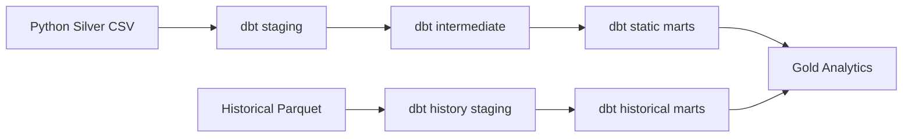

# dbt Analytics Engineering

dbt starts after the Python Silver layer. Python remains responsible for ingestion, parsing, Bronze, and Silver generation. dbt owns the analytics-engineering layer that models Silver and historical Parquet into Gold-compatible marts.

## Why dbt

dbt adds:

- SQL-first transformation models after Silver.
- Explicit model dependencies with `ref()`.
- Documented models and columns.
- Generic and custom tests.
- Lineage documentation through `dbt docs generate`.

## Project Layout

```text
dbt/
  dbt_project.yml
  profiles.yml
  macros/
  models/
    staging/
    intermediate/
    marts/
  tests/
  snapshots/
  seeds/
```

## Transformation Flow



## Static Mart Models

- `route_daily_trips`
- `route_hourly_departures`
- `stop_daily_departures`
- `network_daily_summary`
- `route_period_summary`
- `route_hourly_headway`
- `route_type_daily_summary`
- `busiest_route_day`
- `busiest_stop_day`

## Historical Mart Models

- `route_delay_history`
- `stop_delay_history`
- `delay_evolution_by_hour`
- `feed_freshness_trend`
- `trip_match_trend`
- `daily_summary`

## Tests

The project includes:

- `not_null`
- `unique`
- `relationships`
- `accepted_values`
- custom `non_negative`
- custom delay reasonableness test

## Commands

```bash
python -m mobility_control_tower.cli run-dbt \
  --silver-run data/silver/tisseo/<run_id> \
  --history-run data/realtime_history/tisseo/trip_updates

python -m mobility_control_tower.cli test-dbt
python -m mobility_control_tower.cli generate-dbt-docs
```

If `dbt` is installed, the wrapper delegates to dbt Core. If not, it writes compatible local artifacts so the project remains demonstrable.

## Lineage

dbt lineage is encoded through `ref()` calls:

```text
stg_* -> int_* -> marts
```

Docs artifacts are written to `dbt/target/`, including a local `index.html`.

