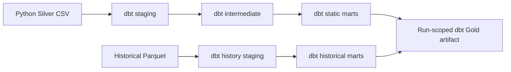

# dbt Analytics Engineering

dbt starts after the Python Silver layer. Python remains responsible for ingestion, parsing, Bronze, Silver, and GTFS-Realtime historical Parquet collection. dbt owns staging, intermediate analytical models, and Gold marts from Silver plus historical Parquet.

## Why dbt

dbt adds:

- SQL-first transformation models after Silver.
- Explicit model dependencies with `ref()`.
- Documented models and columns.
- Generic and custom tests.
- Lineage documentation through `dbt docs generate`.

## Project Layout

```text
dbt/
  dbt_project.yml
  profiles.yml
  macros/
  models/
    staging/
    intermediate/
    marts/
  tests/
  snapshots/
  seeds/
```

## Transformation Flow



## Static Mart Models

- `route_daily_trips`
- `route_hourly_departures`
- `stop_daily_departures`
- `network_daily_summary`
- `route_period_summary`
- `route_hourly_headway`
- `route_type_daily_summary`
- `busiest_route_day`
- `busiest_stop_day`

## Historical Mart Models

- `route_delay_history`
- `stop_delay_history`
- `delay_evolution_by_hour`
- `feed_freshness_trend`
- `trip_match_trend`
- `daily_summary`

## Reliability Models

Production reliability KPIs are dbt Gold models. Python may generate fixtures,
run orchestration, expose API schemas, and provide diagnostic reconciliation
helpers, but it does not calculate authoritative reliability values for API,
dashboard, serving, or incident inputs.

Core reliability models include:

- `int_realtime_eligible_scheduled_trips`: scheduled trips eligible for
  realtime coverage analysis.
- `int_realtime_trip_observations`: canonical Trip Update evidence, including
  match status and explicit cancellation flags.
- `fct_realtime_delay_observations`: delay evidence facts with stale and
  eligibility flags.
- `realtime_trip_coverage`: route-period coverage with observed, unobserved,
  unmatched, ambiguous, and explicit cancellation counts.
- `route_delay_distribution`, `stop_delay_distribution`,
  `network_delay_distribution`: delay percentiles and sample context.
- `route_on_time_performance`, `network_on_time_performance`: configurable
  threshold-based OTP.
- `fct_explicit_trip_cancellations` and cancellation summaries: explicit
  realtime cancellation evidence only.
- `fct_observed_headways`, `fct_headway_reliability_events`,
  `route_excess_waiting_time`: Trip Update approximation headway facts, gap and
  bunching events, and eligible excess waiting time.
- `network_reliability_summary` and `reliability_incident_snapshot`: public
  summary and future incident-evaluator input contract.

## Tests

The project includes:

- `not_null`
- `unique`
- `relationships`
- `accepted_values`
- custom `non_negative`
- custom delay reasonableness test
- dbt unit tests for fan-out, calendar exceptions, after-midnight service-day hours, and missing labels
- semantic reconciliation tests for network and route-type totals
- reliability tests for coverage reconciliation, percentage bounds, delay
  percentile ordering, explicit cancellation semantics, positive headways,
  mutually exclusive headway events, and EWT ineligibility
- reliability unit tests for missing Trip Updates and repeated explicit
  cancellation evidence

## Commands

```bash
python -m mobility_control_tower.cli run-dbt \
  --silver-run data/silver/tisseo/<run_id> \
  --history-run data/realtime_history/tisseo/trip_updates

dbt build --project-dir dbt --profiles-dir dbt --vars '{"silver_run":"data/fixtures/silver/tisseo/phase1","history_run":"data/fixtures/realtime_history/tisseo/trip_updates"}'
```

`run-dbt` requires the real dbt executable. It runs `dbt build`, writes a run-scoped DuckDB database, exports dbt-built mart relations to CSV and Parquet, and writes `dbt_run_manifest.json`. It never invokes Python Gold builders.

Reliability equivalence checks export selected dbt reliability marts and compare
full-refresh, incremental, and second-run idempotent outputs:

```bash
python scripts/export_reliability_outputs.py --database data/fixtures/dbt/ci.duckdb --output-dir data/fixtures/reliability_compare/full
python scripts/compare_reliability_outputs.py --full-refresh data/fixtures/reliability_compare/full --incremental data/fixtures/reliability_compare/incremental
python scripts/assert_incremental_idempotency.py --full-refresh data/fixtures/reliability_compare/incremental --incremental data/fixtures/reliability_compare/idempotent
```

The canonical Gold serving contract is the run-scoped directory under `data/dbt_gold/<source>/<run_id>/` containing `mobility_control_tower_dbt.duckdb`, exported mart files, dbt `target/`, and `dbt_run_manifest.json`.

## Lineage

dbt lineage is encoded through `ref()` calls:

```text
stg_* -> int_* -> marts
```

Docs artifacts are written to `dbt/target/`, including a local `index.html`.
