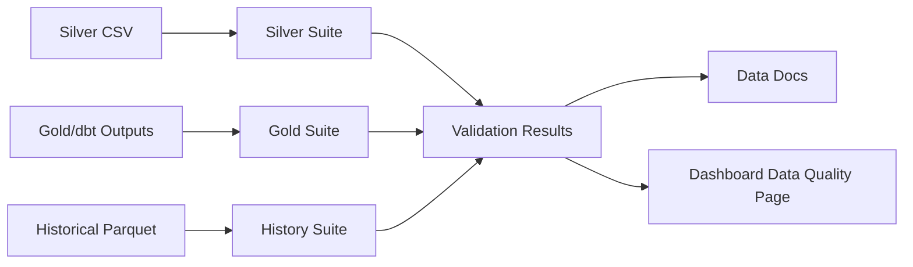

# Great Expectations Data Quality

Great Expectations validates datasets produced by the Mobility Control Tower pipeline. It does not replace GTFS ingestion, parsing, or transformations.

## Why Great Expectations

Great Expectations provides a declarative quality layer for:

- Silver GTFS tables.
- Gold analytics outputs.
- Historical GTFS-Realtime Parquet.
- Data Docs for validation summaries and failed expectations.

## Validation Flow



## Suites

- `silver_suite`: routes, trips, stops, stop_times, relationships, coordinates.
- `gold_suite`: KPI keys, uniqueness, and non-negative counts.
- `history_suite`: Parquet readability, snapshot metadata, feed age, and delay range checks.

## Example Rules

- `route_id` is not null and unique in routes.
- `trip_id` exists from stop_times to trips.
- `stop_id` exists from stop_times to stops.
- stop coordinates are within latitude/longitude bounds.
- delays are between `-7200` and `7200` seconds.
- feed age is non-negative.
- primary dates and snapshot timestamps are present.

## Commands

```bash
python -m mobility_control_tower.cli run-ge-validation \
  --suite all \
  --silver-run data/silver/tisseo/<run_id> \
  --gold-run data/dbt_gold/tisseo/<run_id> \
  --history-run data/realtime_history/tisseo/trip_updates
```

Outputs:

```text
great_expectations/validation_results/
great_expectations/data_docs/local_site/index.html
data/quality/latest_validation_summary.json
```

The dashboard Data Quality page reads the latest summary through the API.

